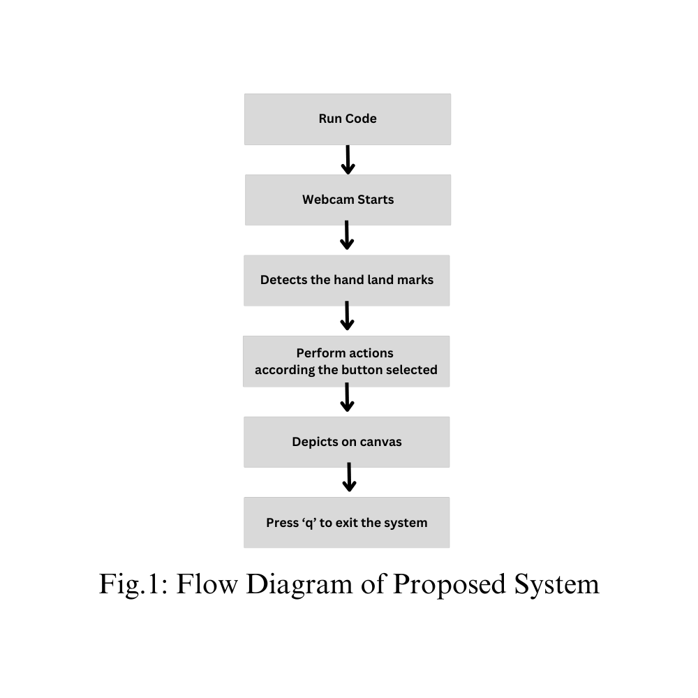
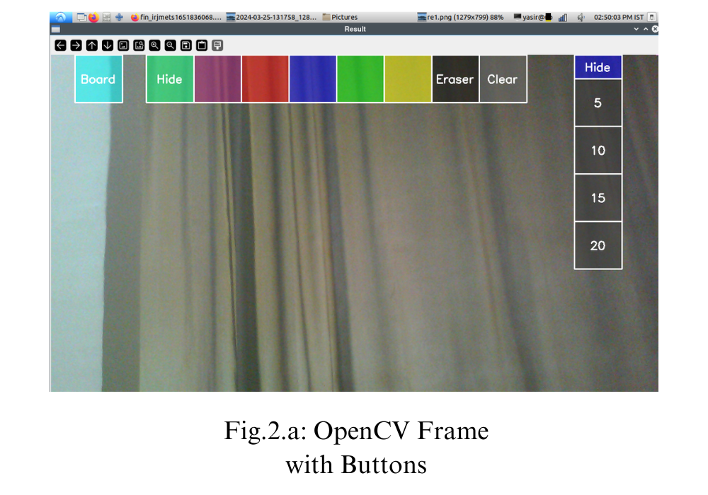
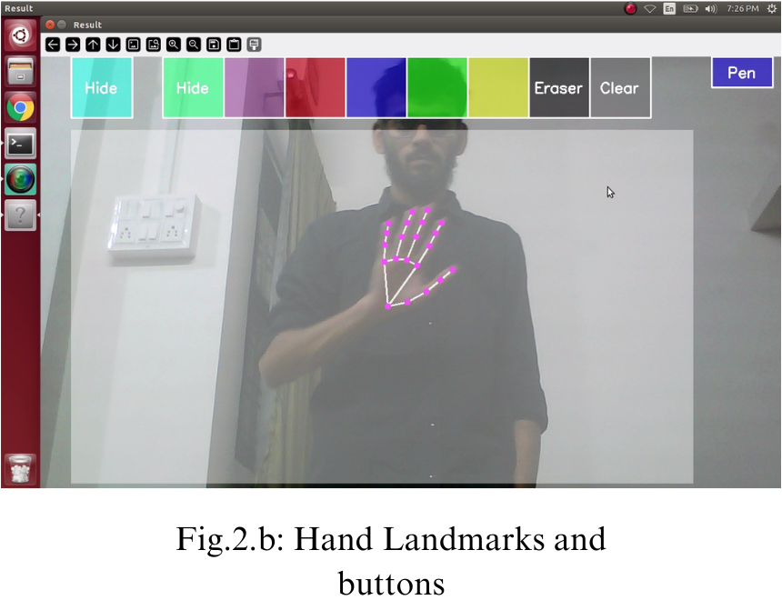
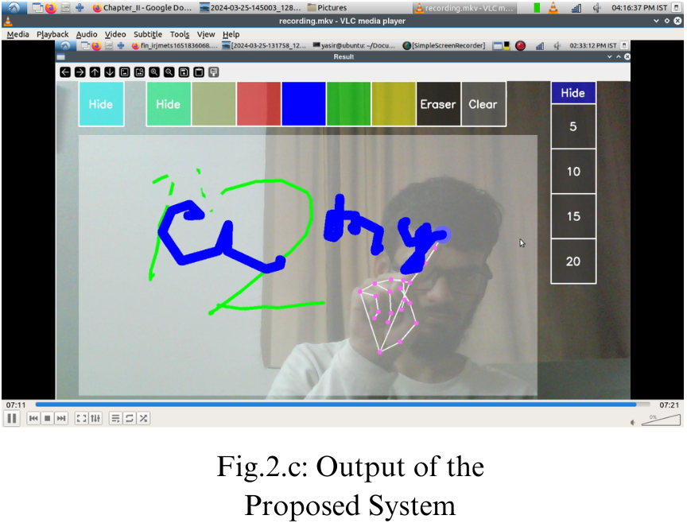

# Design and Develoment of Virtual Air Canvas System

<b>Abstract: </b>With increasing technology each sector needs to be modernized. With the improvement of clever gadgets, the system can now be controlled virtually with the aid of using human gestures. While using paint, sometimes we feel it is difficult to draw and feel like drawing our imagination just by waving our hand. The existing technologies allows us to draw just by waving hand uses technology or methodology which takes a lot of process and time. Avoiding or decreasing these limitations we came up with the Air Canvas System that uses new technologies and easy methodologies. The Air Canvas makes a speciality of growing a motion-to-textual converter. The proposed system works on hand tracking system development which aims to track the hand which acts as pen and functions as pen to create or draw different shapes and also as an eraser using Open Computer Vision Library(Open-CV) and MediaPipe.  System Camera is used to track the hand and create drawings.

<b>Keywords :</b>Air Canvas, MediaPipe, OpenCV, Hand Tracking

<b>Introduction: </b>Air Canvas is a hands-free digital drawing canvas which utilizes camera, OpenCV and MediaPipe to recognize and map the hand gestures. The user finger is considered as the brush or the pen used to draw. The size of the brush can be modified , also the pen color can be changed by hovering the pointer over built-in buttons. This system uses python language to build the code. Camera and MediaPipe is used to track the finger positions. Computer Vision built in methods are used to draw on the canvas or the area provided. We can also save the canvas work as an image.

#### Experimental work:

  

#### Applications
<ul>
  <li>To Develop a platform that enables users to express their creativity in new and innovative ways by writing in Air</li>
  <li>To Develop functionalities that make the Air Canvas System a valuable tool for educators and presenters</li>
  <li>To create a realistic and dynamic simulation of writing and drawing in mid-air</li>
</ul>

#### Results

 

<b>Conclusion: </b>To avoid the use of mouse and difficulty to draw using it in the existing systems , The Air Canvas helps us a lot. The system is also draw or present our imagination just by waving our hand . This uses the easy methods or libraries like use of hardware components like mouse, touch screen etc.

<b>Future Scope: </b>In future, we can also use the proposed system as base for many other hand tracking models. we can also use the system in Sign language detection, Hand Digit Classifier and Text to Speech.

